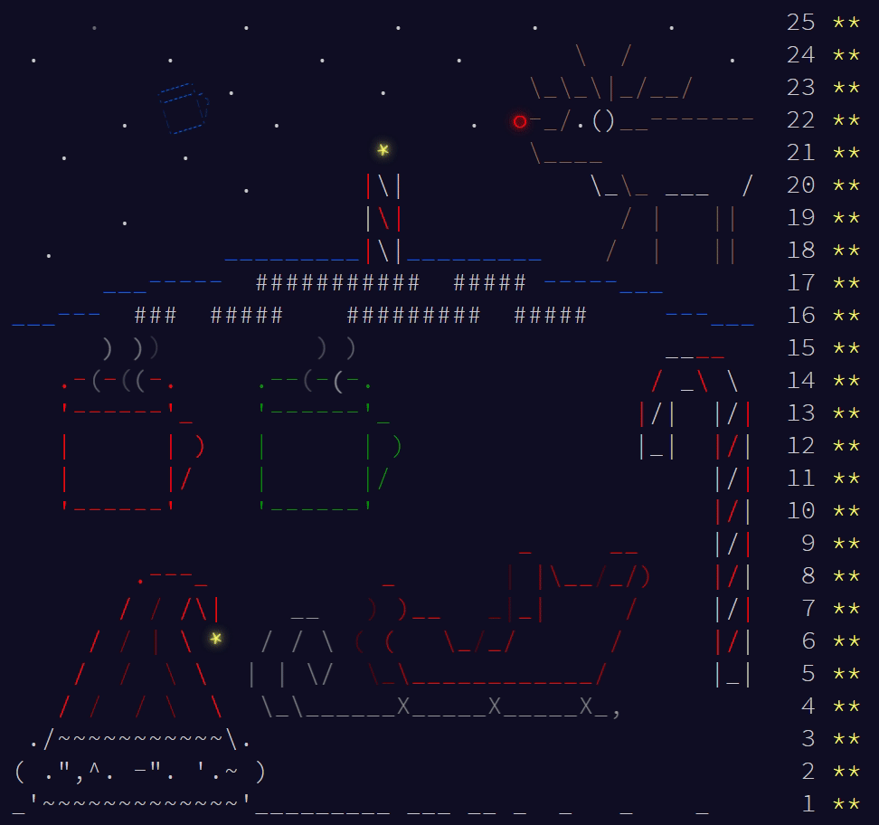

# aoc18
Advent of Code 2018 in C++
## Computation times (no optimization, both parts run separately).
Processor: Intel Core i7-7700HQ, single thread unless indicated

Day | Part One [ms] | Part Two [ms]
--- | ---: | ---:
Day 01: Chronal Calibration | 0.498 | 0.990
Day 02: Inventory Management System | 0.497 | 0.496
Day 03: No Matter How You Slice It | 16.366 | 13.889
Day 04: Repose Record | 4.960 | 4.970
Day 05: Alchemical Reduction | 15.395 | 313.952
Day 06: Chronal Coordinates | 14.880 | 7.428
Day 07: The Sum of Its Parts | 0.498 | 0.998
Day 08: Memory Maneuver | 3.471 | 3.969
Day 09: Marble Mania | 2.972 | 144.332
Day 10: The Stars Align | 12.386 | - 
Day 11: Chronal Charge | 3.976 | 122.026
Day 12: Subterranean Sustainability | 0.992 | 2.487
Day 13: Mine Cart Madness | 1.500 | 2.467
Day 14: Chocolate Charts | 12.895 | 465.287
Day 15: Beverage Bandits | 2029.642 | 2392.206
Day 16: Chronal Classification | 5.457 | 5.953
Day 17: Reservoir Research | 8.432 | 8.431
Day 18: Settlers of The North Pole | 8.430 | 427.569
Day 19: Go With The Flow | 61.513 | 0.982
Day 20: A Regular Map | 549.608 | 586.728
Day 21: Chronal Conversion | 0.990 | 226.664
Day 22: Mode Maze | 0.992 | 41.671
Day 23: Experimental Emergency Teleportation | 5.461 | 8.427
Day 24: Immune System Simulator 20XX | 3.461 | 62.994
Day 25: Four-Dimensional Adventure | 11.016 | - 

## And so the time stream has been fixed
